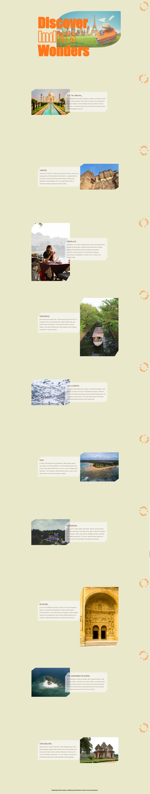

# Scroll-Triggered Content Reveal with CSS Animations

### Author
##### Virendra D. Verma

<a href="https://www.linkedin.com/in/dharmendraverma95/" target="_blank">LinkedIn Profile </a>

<a href="https://www.behance.net/dhirukumar" target="_blank">Behance Profile </a>

# Overview

# Scroll-Triggered Content Reveal with CSS Animations

Welcome to the Scroll-Triggered Content Reveal with CSS Animations project! This guide demonstrates how to use CSS and scroll events to create dynamic content reveal effects as users scroll down your webpage.

## Features
- **CSS-Only Solution**: Achieve horizontal scrolling with just CSS, no JavaScript required.
- **Sticky Elements**: Use `position: sticky` to create fixed scrolling elements that stay in place while the content scrolls horizontally.
- **Responsive Design**: Easily adaptable for different screen sizes and devices.

# Preview
Scroll-Triggered Content Reveal with CSS Animations
 
<a href="https://www.behance.net/gallery/218213655/Scroll-Triggered-Content-Reveal" target="_blank">

 

 
Scroll-Triggered Content Reveal with CSS Animations Start & End Point 
 
Cover
 

 

### Technologies Used
<ul>
  <li>Graphic Design Software: Adobe Illustrator, Photoshop, Figma (for mockups)</li>
  <li>Web Tools (Optional): HTML5, CSS3 for any digital presentations or landing pages</li>
  <li>No JavaScript: This effect is implemented purely with CSS.</li>
</ul>

### Contribution
Feel free to fork this repository and contribute by submitting pull requests. If you find any bugs or issues, please report them in the Issues section.

###  Acknowledgments
Inspired by the power of CSS positioning and scrolling techniques.

